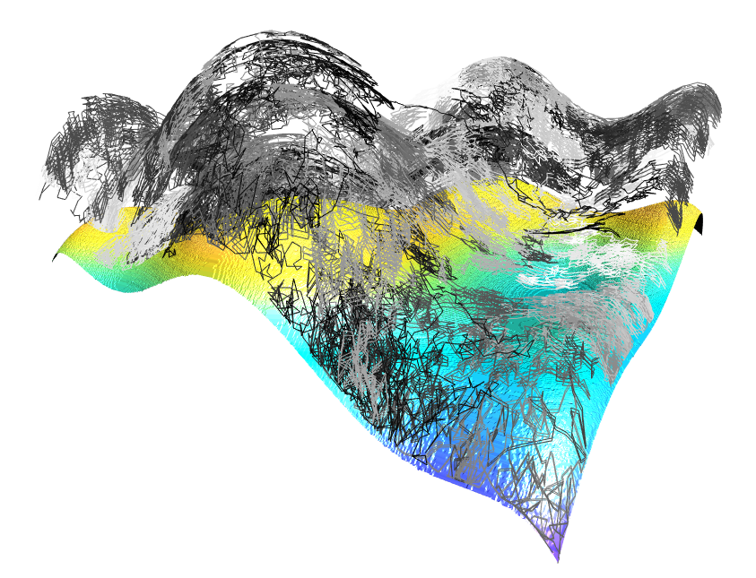

# Fitness landscape visualizations
Using virtual reality to better interpret fitness landscapes and how lineages traverse them under different evolutionary scenarios. You can view the visualization [here](https://emilydolson.github.io/fitness_landscape_visualizations).

# Capsule summary (from paper abstract)

Understanding the evolutionary dynamics created by a given evolutionary algorithm is a critical step in determining which  ones are most likely to produce desirable outcomes for a given problem. While it is relatively easy to come up with hypotheses that could plausibly explain observed evolutionary outcomes, we often fail to take the next step of confirming that our proposed mechanism accurately describes the underlying evolutionary dynamics. Visualization is a powerful tool for exploring evolutionary history as it actually played out. 
We can create visualizations that summarize the evolutionary history of a population or group of populations by drawing representative lineages on top of the fitness landscape being traversed. This approach integrates information about the adaptations that took place with information about the evolutionary pressures they were being subjected to as they evolved.
However, these visualizations can be challenging to depict on a two-dimensional surface, as they integrate multiple forms of three-dimensional (or more) data.
Here, we propose an alternative: taking advantage of recent advances in virtual reality to view evolutionary history in three dimensions. This technique produces an intuitive and detailed illustration of evolutionary processes.

# Built using:

- [A-Frame](https://aframe.io/) - A framework for building scenes that can be rendered to WebVR or WebGL as appropriate.
- [A-Frame heatmap3d component](https://github.com/morandd/aframe-heatmap3d) - To make the fitness landscape surface
- [A-Frame camera-transform-controls component](https://github.com/fernandojsg/aframe-camera-transform-controls-component) - To enable zoom in and out gestures in VR when two 6DOF hand-controllers are connected.
- [Bootstrap](https://getbootstrap.com) - To make the website pretty + mobile friendly
- [Open Iconic](https://useiconic.com/open/) - For the icons on the buttons on the website

# FAQ

### What is this showing?
This will all make a lot more sense if you read one of the associated papers (pre-prints forthcoming), but the basic idea is that this visualization allows us to quickly get a sense of the aggregate effect of the long sequence of small events that make up the process of evolution. Each one of the paths that you can draw on the landscape represents the entire chain of ancestry for a single evolved individual. Each individual is an x,y coordinate pair. The populations are evolving on 2-input real-valued functions (represented by the curved surface). Fitness is evaluated by plugging an individual's x and y coordinates into the function. Individuals are then plotted on the surface, with fitness being the z coordinate. 

The individuals in this data set were all the fittest member of the population at the end of their respective runs of the algorithm. By drawing paths from their coordinates, to their parents' coordinates, to their grandparents' coordinates and so on, we can see how evolution traverses this fitness landscape. 

If you've looked at the settings panel, you'll notice there are a lot of options. That's because this data represents a large number of runs of evolution in a wide variety of conditions. The settings panel lets you choose subsets to look at.

### Why is nothing showing up?

Probably because you haven't told it to draw anything! Go to settings (gear icon), check the boxes for the annotations you want (e.g. spheres for start and end points, paths for full lineages), and then click the "Draw" button. It might take a bit to render, but data should show up. 

Note that at low mutations rates lineages are often very short and can be hard to see. 

If there is still nothing, send me an issue on GitHub - this is all still pretty experimental.

### What are some good settings to start with?

Try setting "Selection Scheme" to Eco-EA, "Mutation rate" to .01, and checking the "Draw lineage paths" box. Leave everything else as the default. This should show you a single lineage traversing the landscape. If you want to try looking at multiple lineages, try setting "Number of lineage paths to draw" to 2 and increasing the Z-separation slider about halfway. From there, feel free to change things and see what happens! In general, mutation rates lower than .01 tend to stay fixed in a pretty small part of the landscape, and Eco-EA tends to travel farther than other selection schemes.

### What VR devices are supported?

Check out [webvr.rocks](webvr.rocks) for more thorough information. In general, most browsers will at least render it in WebGL. In this mode, you can use your mouse to click and drag to rotate the visualization and see it from different angles. 

To use virtual reality, you need something more advanced. 

If you have a phone-mount headset, such as Google Cardboard, and a phone that is compatible with it, you should be able to use that. Navigate to this website on your phone, select and draw the data you want to see, and tap the goggles icon in the lower right corner. This should open it in VR mode (in which your phone displays two images, one for each eye). You can then put the phone in the headset and look at the visualization in three dimensions. 

If you have a more advanced VR system, such as an Oculus Rift or HTC Vive, you can open this webpage on the computer connected to the VR system. Clicking the gray goggles icon in the lower right corner should bring up the visualization on your headset. You can then put on the headset and walk around the visualization. If you have two hand controllers, you can use them to zoom in and out with pinch and spread gestures (like you would use on a touch screen). Note that this has been tested on a Rift, but not yet on a Vive. If you try it on a Vive (or something else, like Windows Mixed Reality) I'd love to hear how it goes.

### What are the different selection schemes?

Tournament selection: TOURNAMENT_SIZE individuals are chosen randomly from the population and the fittest reproduces. Increasing tournament size essentially increases the strength of selection. 

Roulette selection: Individuals are chosen to reproduce with probability proportional to their fitness. 

Eco-EA: Like tournament selection, except that individuals receive fitness bonuses for occupying rare niches (in these problems, that entails being in a part of the landscape where there aren't many other individuals). For more detail, see (Goings and Ofria, 2010). 

Drift: Individuals are selected to reproduce entirely at random.

### Where did these fitness functions come from?

The [GECCO Niching competition](http://www.epitropakis.co.uk/gecco2018/).

### I want to know more about using VR for data visualization

Me too! There's still a lot for everyone to learn about how to most effectively take advantage of virtual reality for data visualization. The Knight Foundation has been doing some really great work to figure all of this out. I found this article particularly helpful, and this article has a bunch of really cool examples. Their work is all aimed at journalism, though. I'm planning on writing a blog post soon, detailing what this project has taught me specifically about using VR for data visualization in the context of evolution.
